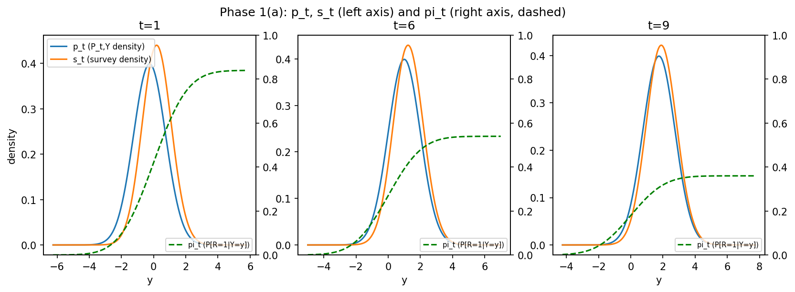
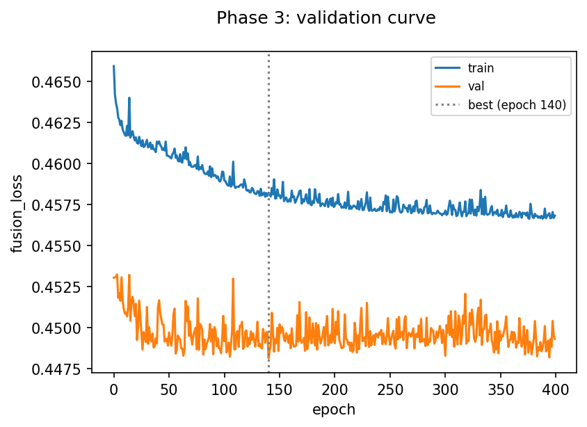
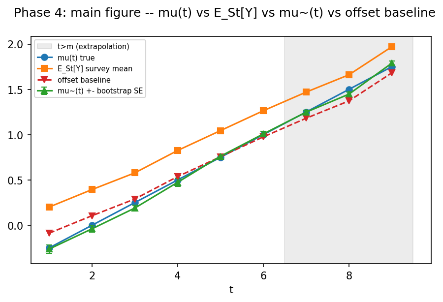

# Data Fusion Interview Challenge -- slides (Keynote-paste fallback)

## The data-generating process

- P_t on (Y x {0,1}); pi_t(y) := P[R=1|Y=y] = c_t * Phi(beta*y); P_t,Y = N(m_t, sigma^2)
- S_t = Law(Y|R=1), density s_t = pi_t*p_t / rho_bar_t
- m=6, M=9, n=2000, sigma=1.0, beta=0.6, m_t=-0.5+0.25t, c_t=0.9-0.06t
- Assumption 1 holds exactly: Phi(beta*y)/Phi(beta*y') has no t. rho_bar_t = c_t*Phi(a_t) varies with t but cancels out of S_t
- Sampler: Y~N(m_t,sigma^2), R~Bern(c_t*Phi(beta*Y)), keep Y with R=1 -- rejection sampling IS conditioning on R=1
- theta*(y) = log Phi(a_m) - log Phi(beta*y); alpha*(t) = log Phi(a_t) - log Phi(a_m)
- Design rule (R3): beta*sigma < 1/sqrt(2) (=0.7071); tail index a = 1+1/(beta^2 sigma^2) = 3.78 (R3 holds: True)

_Survey bias E_St[Y]-mu(t) falls from +0.454 at t=1 to +0.168 at t=9 -- a constant-bias baseline must fail_

## Solving the optimization problem

- Pooled F over rows (t,z,y), 2mn=24000 rows; L=mean((1-z)*exp(r)-z*r), r=theta(y)+alpha[t]
- Why this loss: its minimizer over separable r is log dP_t,Y/dS_t (the NWJ variational form of KL); alpha(t)=-log E_St[e^theta] is a per-year log-partition constant; the anchor alpha(m)=0 removes the flat direction (theta+c, alpha-c)
- Implementation: theta=MLP(1->H->1,ReLU,H=32); alpha=free vector in R^(m-1) concat with a constant 0; float64; Adam lr=0.001, wd=1e-05 (network only), batch=256; stratified 80/20 split; early stopping on validation risk
- Early stopping is REQUIRED, not cosmetic: R_hat_n is unbounded below for an interpolating theta. Measured: best val loss 0.4481 at epoch 140 of 400 run -- the best checkpoint is NOT the last epoch
- Verification: 14 passed in 39.73s. T4 torch-vs-numpy: loss diff 5.6e-17, worst grad diff 6.9e-17; T7 parametric recovery a_hat=1.0063; T11 weight tails a=3.78, n_eff CV=0.048, SE ratio=0.99
- Diagnostics before any mu~ is reported: FOC mean_i e^(theta~+alpha~(t)) per year [t=1:1.037, t=2:1.012, t=3:1.003, t=4:0.998, t=5:0.988, t=6:0.969]; theta~ vs theta* grid; n_eff

## Results and learnings

-  t   mu(t)  survey     mu~(t)+-SE  offset  oracle  n_eff/n
 7   1.250   1.469   1.265+-0.022   1.181   1.275     0.94
 8   1.500   1.693   1.484+-0.024   1.405   1.502     0.94
 9   1.750   1.881   1.684+-0.026   1.593   1.709     0.95
- Learning 1: alpha(t) is the unknown per-year normalising constant and it CANCELS in mu~=E_St[e^theta Y]/E_St[e^theta] -- lagged population data teaches theta's SHAPE only, never the current-year level, which is exactly what makes t>m possible
- Learning 2: the weight tail index decides whether ANY of the inference is valid. E_St[w^k]<inf iff k<a=1+1/(beta^2 sigma^2). Old beta=1.5: a=1.44, n_eff/n CV=0.790 across seeds, delta-SE 2.49x the true sampling sd, bias decay ~n^-0.36 (predicted n^-0.31) instead of n^-1, T7 a_hat=1.0255 (fails |a-1|<0.02). beta=0.6: a=3.78, CV=0.048, SE ratio=0.99, T7 a_hat=1.0063 (passes). One defect, not four
- Learning 3: what remains is approximation error, not sampling error. n_eff/n is 0.94-0.95, but theta~ drifts below theta* in the right tail, where 12.6% of S_9's mass sits (y>3), and that drift alone accounts for the mu~(9) undershoot (implied shift -0.0289 vs actual -0.0289, 300 reps of n=200). theta* is strictly decreasing, convex, bounded below by log Phi(a_m)=-0.362; the current bounded head B=20 never binds (theta* in [-0.36, 4.23] over the training range) -- identified and quantified, not yet applied

