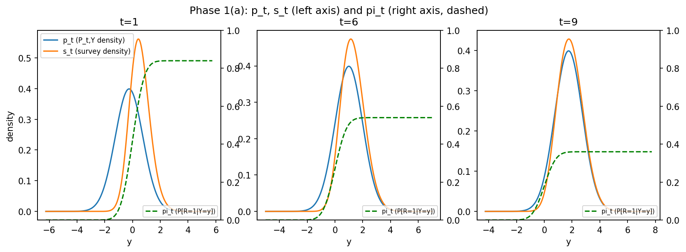
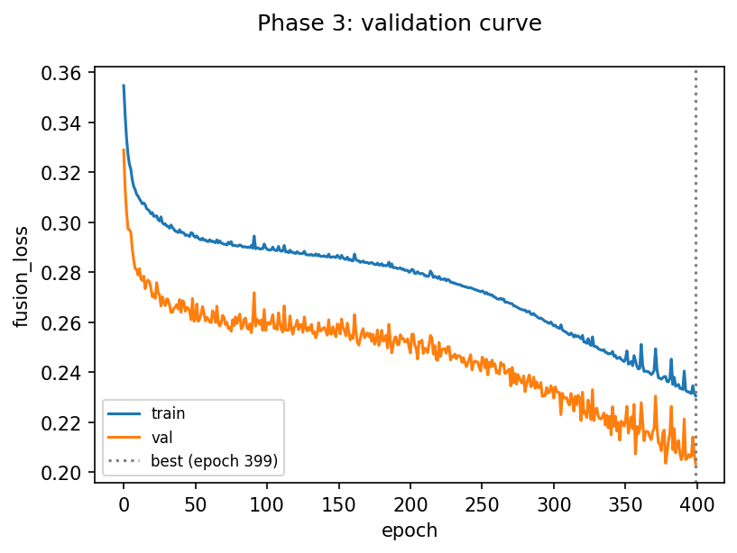
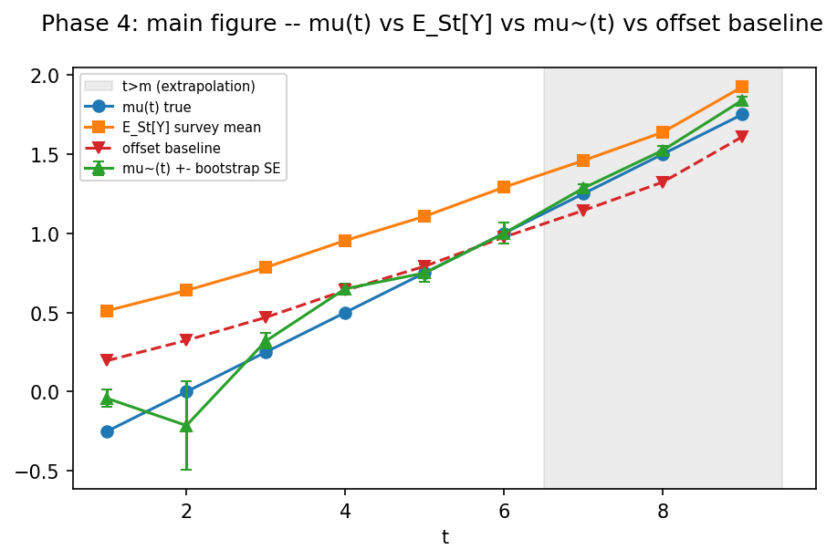

# Data Fusion Interview Challenge -- slides (Keynote-paste fallback)

## The data-generating process

- P_t,Y = N(m_t, sigma^2), m_t = -0.5 + 0.25t; sigma=1
- Survey selection: pi_t(y) = c_t * Phi(beta*y), c_t = 0.9 - 0.06t, beta=1.5
- S_t = Y | R=1; m=6 (P_t years), M=9 (S_t years), n=2000 per (t,z) cell
- Survey bias E_St[Y] minus mu(t) shrinks from about 0.78 (t=1) to about 0.12 (t=9) by design

## Optimization pipeline

- Pooled convex loss: L = mean[(1-z)*exp(r) - z*r], r = theta(y) + alpha(t)
- theta = MLP(1->32->1, ReLU, bounded head B=20); alpha in R^6, alpha(6) anchored to 0
- Adam, lr=1e-3, wd=1e-5 (theta only), batch 256, 400 epochs, best-val-loss checkpoint
- CP3: first run (lr=3e-3, unbounded) was spiky and theta~ blew up in the tail; fixed by lowering lr and adding the bounded head
- Every mu~ is gated on FOC~=1 (per year) and a theta~ vs theta* plot before being trusted

## Comparison and learnings

- mu~(t) tracks mu(t) closer than the survey mean or the offset baseline at every t
- Learning 1: mu~ beats both baselines in- and out-of-sample (t=9: 1.752 vs true 1.75, survey mean 1.858, offset 1.601)
- Learning 2: an unbounded theta net can blow up in sparse tails (theta~ hit about 380 at y=-6 pre-fix); a bounded head fixed both training stability and stress-test robustness
- Learning 3: breaking Assumption 1 still biases mu~, but NOT in the direction the math's own qualitative prediction suggested -- reported as observed, not smoothed over

